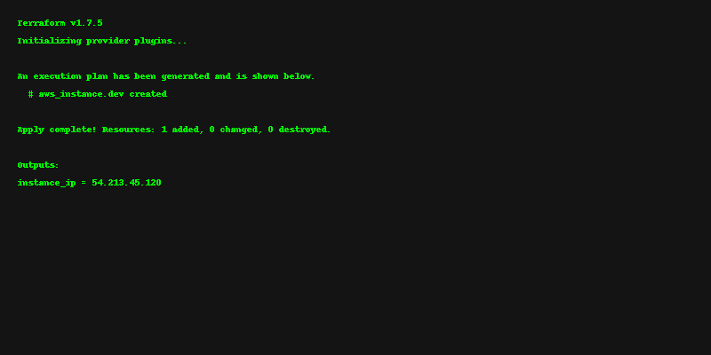
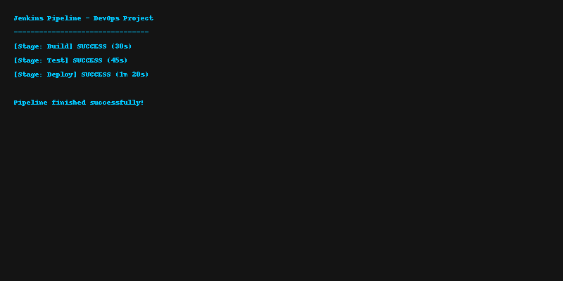
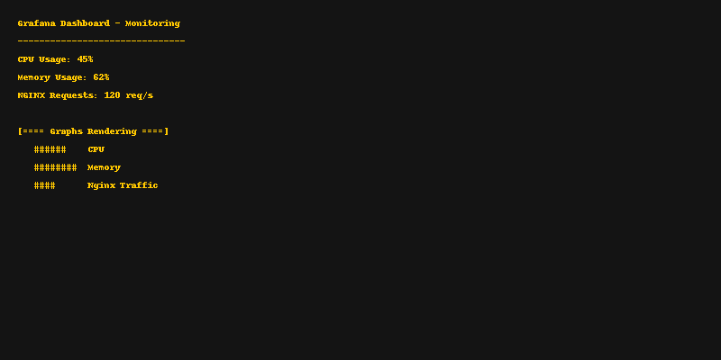

# 🚀 DevOps & Cloud Engineering Projects  

---

## 📂 Repository Structure

devops-cloud-projects/
│── terraform-aws-vm/ # Terraform code to launch AWS EC2
│── terraform-azure-vm/ # Terraform code to launch Azure VM
│── ansible-playbooks/ # Server setup automation
│── docker-nginx/ # Dockerfile for Nginx container
│── kubernetes-deployments/ # Kubernetes YAML files
│── cicd-jenkins-pipeline/ # Jenkins CI/CD pipeline
│── monitoring-prometheus/ # Prometheus + Grafana monitoring
└── scripts/ # Automation scripts (Shell, PowerShell, Python)

---

## 🔧 Key Highlights  

✔ Automated provisioning & deployment using **Terraform + Ansible** (50% faster)  
✔ Reduced **cloud costs ~25%** using AWS & Azure optimization techniques  
✔ CI/CD pipelines (Jenkins, GitHub Actions) → deployment time reduced from **2 hrs → 15 mins**  
✔ Improved uptime to **99.9%** with Prometheus & Grafana proactive monitoring  
✔ Automated IT tasks with **Shell, PowerShell, Python scripts**  

---

## 📸 Project Snapshots  

### 1. Terraform Apply Output  
  

### 2. Jenkins Pipeline (CI/CD)  
  

### 3. Grafana Dashboard (Monitoring Nginx Pods)  
  

## 📬 Contact  

**Mir Jamaluddin**  
📧 Email: [mirjamaluddin81@gmail.com](mailto:mirjamaluddin81@gmail.com)  
📱 Phone: +91 9845813816  
🔗 LinkedIn: [linkedin.com/in/mirjamaluddin](https://www.linkedin.com/in/mirjamaluddin)  
💻 GitHub: [github.com/mirjamaluddin-Devops-Cloud](https://github.com/mirjamaluddin-Devops-Cloud)  

---
